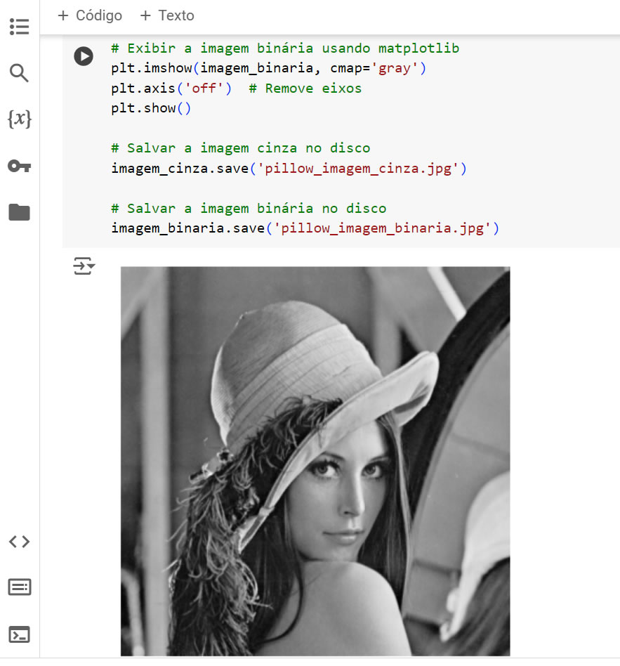

# Redução de Dimensionalidade em Imagens para Redes Neurais

No desafio do terceiro módulo do Bootcampo BairesDev - Machine Learning Practitioner promovido pela DIO chamado "Redução de Dimensionalidade em Imagens para Redes Neurais" foi feita a manipulação de uma imagem RGB, convertendo ela para tons de cinza e preto e branco. O código foi implementado no Google Colab.

Foram utilizadas as seguintes bibliotecas

OpenCV
Pillow
Scikit-image

## Sobre a imagem

Lenna (ou Lena) é uma imagem de teste padrão usada na área de processamento digital de imagens desde 1973. É uma foto da modelo sueca Lena Forsén, tirada pelo fotógrafo Dwight Hooker e recortada da página central da edição de novembro de 1972 da revista Playboy.
